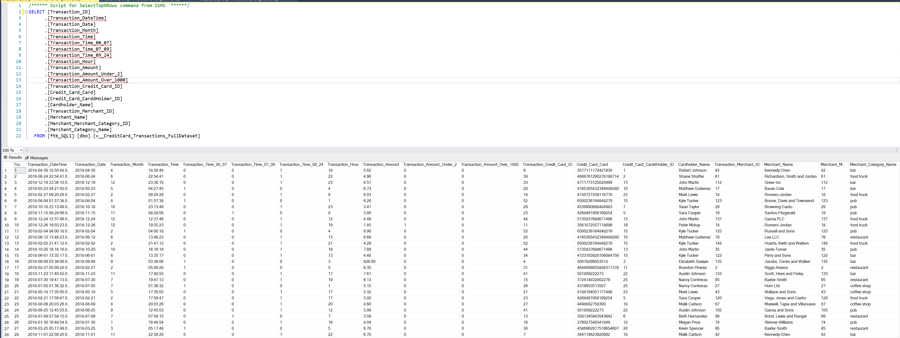
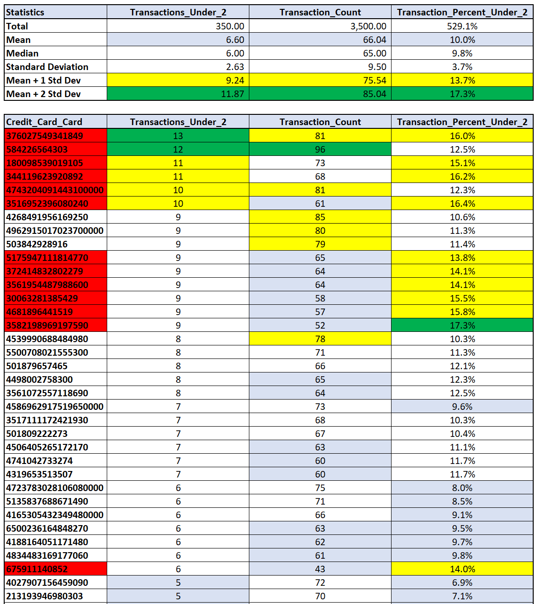
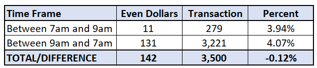
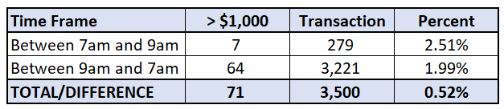
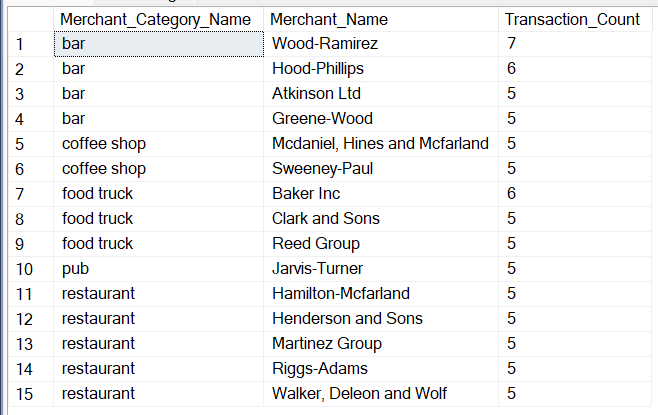

# FinTech Bootcamp Module 7 - SQL Assignment
Repo: ftb07_SQL_Challenge
  
## Data Analysis  
  
### Part 1: Overview  
The CFO of your firm has requested a report to help analyze potential fraudulent transactions. Using your newly created database, generate queries that will discover the information needed to answer the following questions, then use your repository's ReadME file to create a markdown report you can share with the CFO:  
* Some fraudsters hack a credit card by making several small transactions (generally less than $2.00), which are typically ignored by cardholders.   
  * How can you isolate (or group) the transactions of each cardholder?  
  * Count the transactions that are less than $2.00 per cardholder.   
  * Is there any evidence to suggest that a credit card has been hacked? Explain your rationale.  
* Take your investigation a step futher by considering the time period in which potentially fraudulent transactions are made.   
  * What are the top 100 highest transactions made between 7:00 am and 9:00 am?  
  * Do you see any anomalous transactions that could be fraudulent?  
  * Is there a higher number of fraudulent transactions made during this time frame versus the rest of the day?  
  * If you answered yes to the previous question, explain why you think there might be fraudulent transactions during this time frame.  
* What are the top 5 merchants prone to being hacked using small transactions?  
* Create a view for each of your queries.  

### Preparing for Data Analysis
* Create a View that provides the complete dataset  
    * The purpose of this view is to transform the data to support the analysis at hand
      * Identify Transaction Under $2
      * Identify Special Timeframes (like 7am to 9am)
      * Itentify Even Value Transactions
      * Identify Transactions over $1000
    * Sample Data  
      
    * SQL View  
      * [Master View Credit Card Transactions](code/dbo.v__CreditCard_Transactions_FullDataset.View.sql)
    
### Part 1: Analysis in SQL  
* Create a View that shows credit cards with a large number of small value transactions (Undrer $2)  
    * The following is evidence that a credit card may have been hacked  
      * Large number of small values transactions  
      * A high percentage of small value transactions vs. a low number of transations (less than the mean)  
      * Consider values that are 1 (Green) or 2 (Yellow) standard deviations from the mean  
    * Credit cards marked in Red are candidates for further analysis  
        
    * SQL Views  
      * [Transactions Under $2](code/dbo.v_CreditCard_Transactions_Under_$2.View.sql)  
  
* Create a view that shows high value transaction through the 7am to 9am time period  
    * Anomalus transactions that may be fraudulent  
      * There are 9 transactions > $100) between 7am and 9am that apear suspicious  
          
      * Suspicion 1 is that they are even dollar transactions (no pennies)   
        * There are the same percent of even dollar transactions in both time periods  
               
      * Suspicion 2 are the transactions Over $1000  
        * There is a higher percent of transactions over $1000 in the 7am to 9am time frame    
            
    * SQL Views  
      * [Top 100 Transactions 7am to 9am](code/dbo.v_CreditCard_Transactions_Between_7am_9am_Top100.View.sql)  
      * [Even Value Transactions 7am to 9am](code/dbo.v_CreditCard_Transactions_Between_7am_9am_Even.View.sql)   
      * [Even Value Transactions 9am to 7am](code/dbo.v_CreditCard_Transactions_Between_9am_7am_Even.View.View.sql)  
      * [Transactions > $1000 7am to 9am](code/dbo.v_CreditCard_Transactions_Between_7am_9am_Over_1000.View.sql)  
      * [Transactions > $1000 9am to 7am](code/dbo.v_CreditCard_Transactions_Between_9am_7am_Over_1000.View.sql)  
   
* Create a view that shows merchats with with a large number of small value transactions  
    * There are 15 merchants with 5-7 transactions below $2  
        
    * SQL Views  
      * [Top 5 Merchants](code/dbo.v_CreditCard_Transactions_Under_$2_Merchant.View.sql)  
    
### Part 2: Overview   
Your CFO has also requested detailed trends data on specific card holders. Use the [starter notebook](Starter_Files/challenge.ipynb) to query your database and generate visualizations that supply the requested information as follows, then add your visualizations and observations to your markdown report:  
* The two most important customers of the firm may have been hacked. Verify if there are any fraudulent transactions in their history. For privacy reasons, you only know that their cardholder IDs are 2 and 18.  
  * Using hvPlot, create a line plot representing the time series of transactions over the course of the year for each cardholder separately.   
  * Next, to better compare their patterns, create a single line plot that contains both card holders' trend data.   
  * What difference do you observe between the consumption patterns? Does the difference suggest a fraudulent transaction? Explain your rationale.  
* The CEO of the biggest customer of the firm suspects that someone has used her corporate credit card without authorization in the first quarter of 2018 to pay quite expensive restaurant bills. Again, for privacy reasons, you know only that the cardholder ID in question is 25.  
  * Using hvPlot, create a box plot, representing the expenditure data from January 2018 to June 2018 for cardholder ID 25.    
  * Are there any outliers for cardholder ID 25? How many outliers are there per month?  
  * Do you notice any anomalies? Describe your observations and conclusions.  
  
### Part 2: Analysis in Python  
* Create a View that provides the complete dataset  
    * [Master View](code/dbo.v__CreditCard_Transactions_FullDataset.View.sql)
    

* Create a View that shows credit cards with a large number of small value transactions  
    * [SQL View: Transactions under $2](code/dbo.v_Credit_Cards_Trans_Under_%242.View.sql)  
    * Results  
      
  
* Create a view that shows high value transaction through a time period  
    * [SQL View: High Value Transactions 7am to 9am](code/dbo.v_HighestValue_Trans_Between_7and9am.View.sql)  
    * Results  
      
  
* Create a view that shows merchats with with a large number of small value transactions  
    * [SQL View: Top 5 Merchants](code/dbo.v_Merchant_Trans_Under_%242.View.sql)  
    * Results  
      

### Challenge
Another approach to identifying fraudulent transactions is to look for outliers in the data. Standard deviation or quartiles are often used to detect outliers.
Use the [challenge starter notebook](Starter_Files/challenge.ipynb) to code two Python functions:
* One that uses standard deviation to identify anomalies for any cardholder.
* Another that uses interquartile range to identify anomalies for any cardholder.
For help with outliers detection, read the following articles:
* [How to Calculate Outliers](https://www.wikihow.com/Calculate-Outliers)
* [Removing Outliers Using Standard Deviation in Python](https://www.kdnuggets.com/2017/02/removing-outliers-standard-deviation-python.html)
* [How to Use Statistics to Identify Outliers in Data](https://machinelearningmastery.com/how-to-use-statistics-to-identify-outliers-in-data/)

