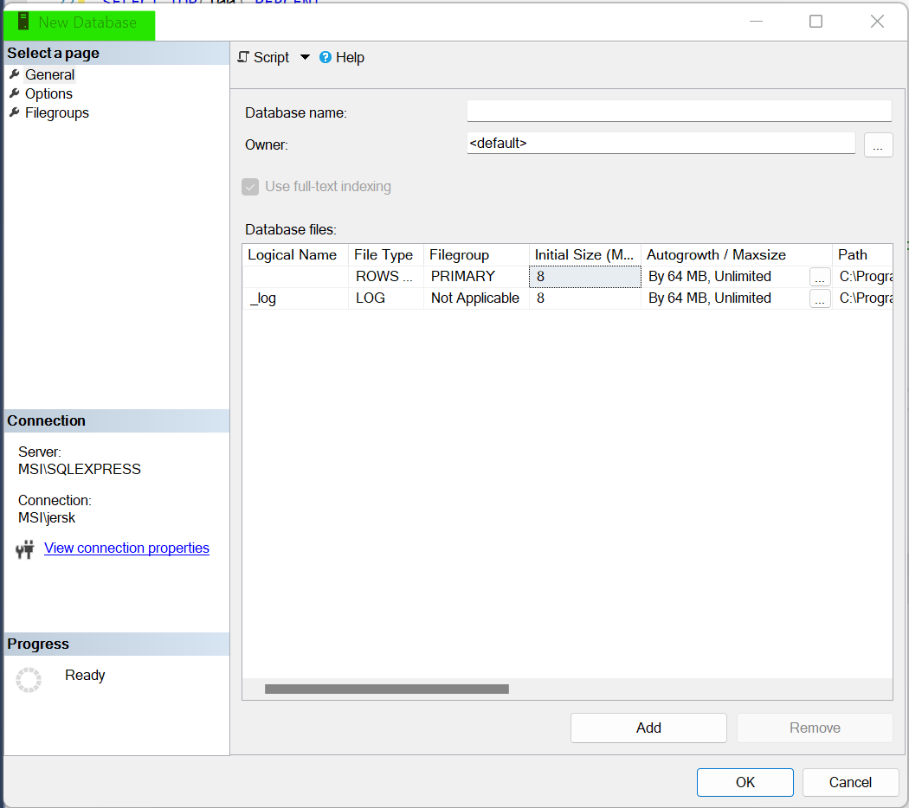
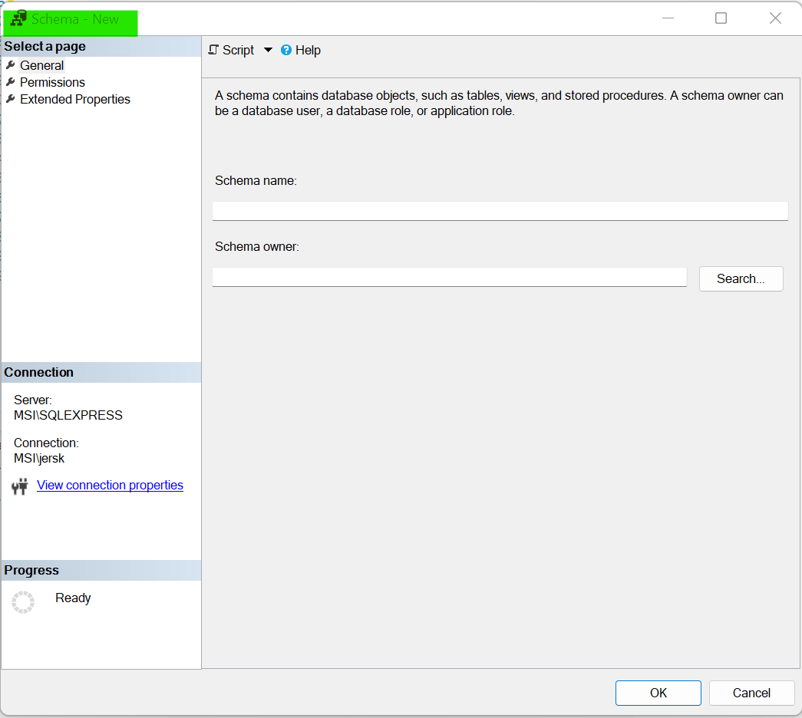
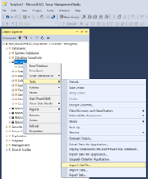
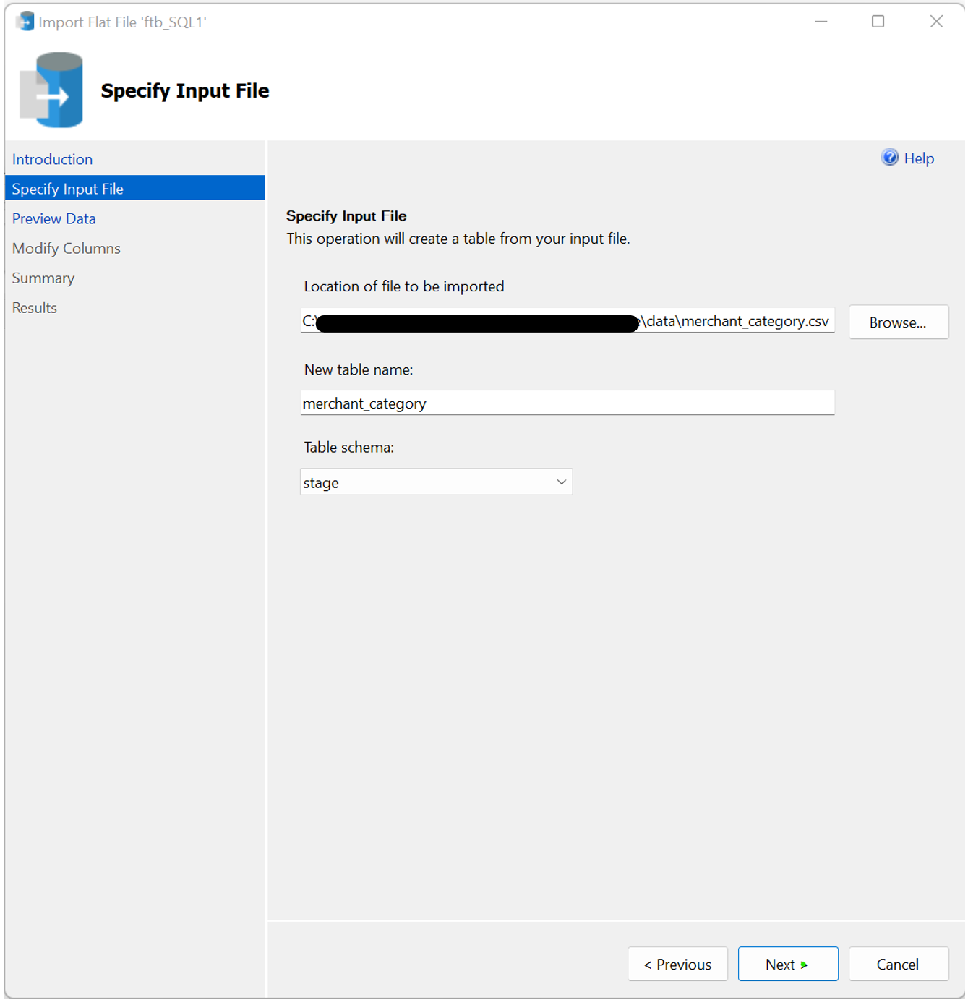
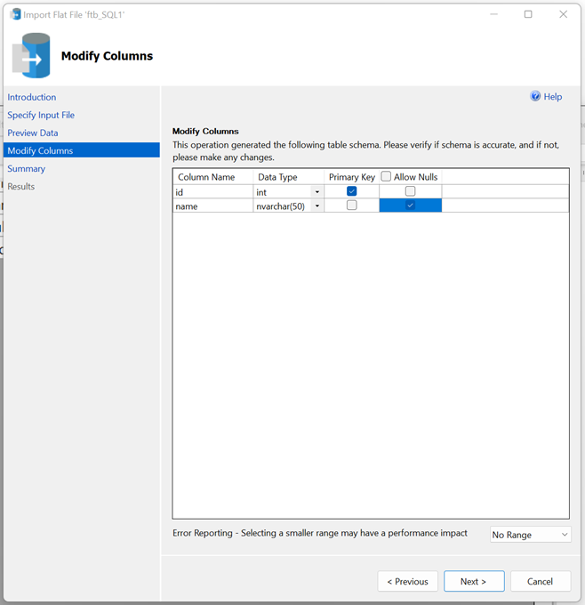
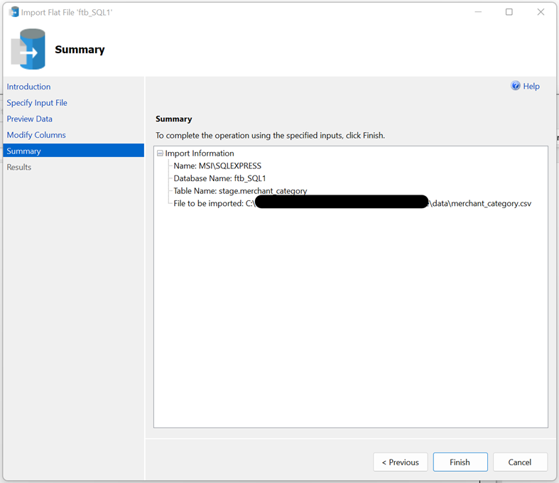
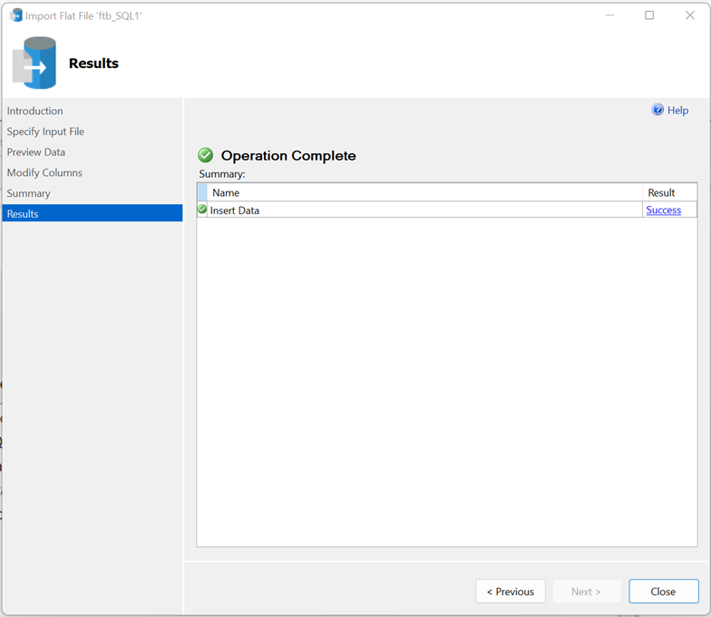
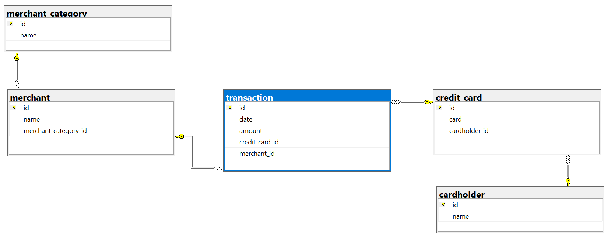

# FinTech Bootcamp Module 7 - SQL Assignment
Repo: ftb07_SQL_Challenge

### Data Engineering
    * Using your database model as a blueprint, create a database schema for each of your tables and relationships.   
    * Remember to specify data types, primary keys, foreign keys, and any other constraints you defined.
    * After creating the database schema, import the data from the corresponding CSV files.

## Process: Create and Populate a Database
1. Data Warehouse Approach
    * SQL Server Naming Convention:
        * [Server Name].[Database Name].[Schema Name].[Table Name].[Feild Name]
    * Data imported from other systems is staged. 
        * A shcema called "stage" can be used to isolate this data.  
    * Data is moved from the staged tables into the procduction tables. 
        * Production tables use the "dbo" (Database Object) schema.  
    * The process is refered to as Extract Transform and Load (ETL). Examples:  
        * Hints suggested transforming the card field from int ot varchar(20)  
        * Hints suggested transforming the date field to timestamp  
    * Repeatability: The entire process can be automated
        * Stored Procedures run the various scripts
        * A Database Analyst (DBA) can set the stored proceedures to run automatically (over night)  

2. Create a Database
    * Right-Click Databases --> New Database
    * Parameter selection to be added later
    * 

3. Import Data
    * Create a schemna called "stage". One time process.  
        * Database --> Security --> Right-Click Schemas --> New Schema
        * Parameter selection to be added later  
        * 
    * Import CSV files 
        * Right-Click Database --> Tasks --> Import Flat File
            1. Launch Wizzard  
            
            2. Select CSV file  
            
            3. Preview Data  
            
            4. Configure Columns  
            
            5. Verify Import Parameters  
            
            6. Import Result  
            
        * CSV Files Imported:
            * [CSV File: Merchant_Category.csv](data/merchant_category.csv)
            * [CSV File: Cardholder.csv](data/card_holder.csv)
            * [CSV File: Credit_Card.csv](data/credit_card.csv)
            * [CSV File: Merchant.csv](data/merchant.csv)
            * [CSV File: Transaction.csv](data/transaction.csv)
    * Validation of Foreign Keys in Staged Data Tables  
        * Views that return records with unmatcked foreign keys  
        * Desired result is that no records are returned in these views:  
        * [Validate Credit Card to Cardholder](code/stage.v_Validate_Credit_Card_TO_Card_Holder.View.sql)  
        * [Validate Merchant to Merchant Category](code/stage.v_Validate_Merchant_TO_Merchant_Category.View.sql)  
        * [Validate Transaction to Merchant to Credit Card](code/stage.v_Validate_Transaction_FK.View.sql)  
        
4. Stored Proceedures: Create Tables  
    * Create Tables:  
        * Stored Proceedures to create tables in the database  
        * [Create Table: Cardholder](code/dbo.sp_Create_Table_Cardholder.StoredProcedure.sql)  
        * [Create Table: Credit_Card](code/dbo.sp_Create_Table_Credit_Card.StoredProcedure.sql)  
            * Deviation from Design: Added id field to replace the card field as the primary key  
            * id field is an Identity Int is automaitically populated/created when new records are added  
        * [Create Table: Merchant_Category](code/dbo.sp_Create_Table_Merchant_Category.StoredProcedure.sql)  
        * [Create Table: Merchant](code/dbo.sp_Create_Table_Merchant.StoredProcedure.sql)  
        * [Create Table: Transaction](code/dbo.sp_Create_Table_Transaction.StoredProcedure.sql)  
            * Deviation from Design: Added credit_card_id field to replace card as the foreign key to the credit card table  
    
5. Stored Proceedures: Insert Data from Imports  
    * Insert Static Data  
        * [Insert Into: Merchant_Category](code/dbo.sp_Insert_Static_Data_Merchant_Category.StoredProcedure.sql)  
    * Insert Master Data  
        * [Insert Into: Cardholder](code/dbo.sp_Insert_Master_Data_Cardholder.StoredProcedure.sql)  
        * [Insert Into: Credit_Card](code/dbo.sp_Insert_Master_Data_Credit_Card.StoredProcedure.sql)  
        * [Insert Into: Merchant](code/dbo.sp_Insert_Master_Data_Merchant.StoredProcedure.sql)   
    * Insert Transaction Data  
        * [Insert Into: Transaction](code/tdbo.sp_Insert_Transaction_Data_Transaction.StoredProcedure.sql)  
    * Update Transaction Table with Credit Card ID (Replacing Card as the FK)   
        * [Update Table: Populate Credit Card ID in Transaction Table](code/dbo.sp_Update_Transaction_Data_Credit_Card_ID.StoredProcedure.sql)  
        * [Alter Table: Remove Card field from the Transaction table](code/dbo.sp_Alter_Table_DC_Transaction_Card.StoredProcedure.sql)  

5. Stored Proceedures: Alter Table - Add Foreign Key Constraints  
    * Create foreign key constraints  
    * [FK Credit Card to Cardholder](code/dbo.sp_Alter_Table_FK_Credit_Card.StoredProcedure.sql)  
    * [FK Merchant to Merchant Category](code/dbo.sp_Alter_Table_FK_Merchant.StoredProcedure.sql)  
    * [FK Transaction to Merchant to Credit Card](code/dbo.sp_Alter_Table_FK_Transaction.StoredProcedure.sql)  
        
6. Master Strored Procedure: Runs all stored proceedures  
    * Internal documentation of the Data Engineering Plan  
    * [Master Stored Procedure](code/dbo.sp__Master_Create_Tables.StoredProcedure.sql)  

7. Final: Database Diagram/Schema  
      

