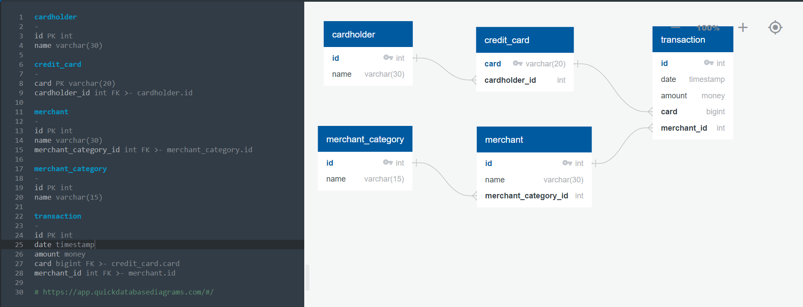

# FinTech Bootcamp Module 7 - SQL Assignment
Repo: ftb07_SQL_Challenge
  
### Data Modeling Instructions
    * Create an entity relationship diagram (ERD) by inspecting the provided CSV files.  
    * Part of the challenge here is to figure out how many tables you should create, as well as what kind of relationships you need to define among the tables.  
    * Feel free to discuss your database model design ideas with your classmates. You can use a tool like [Quick Database Diagrams](https://www.quickdatabasediagrams.com) to create your model.  
  
**Hints:** 
    * For the `credit_card` and `transaction` tables, the `card` column should be a VARCHAR(20) datatype rather than an INT.
    * For the `transaction` table, the `date` column should be a TIMESTAMP datatype rather than DATE.
  
## Overview 
The csv data files provide indicat that we are analyzing credit card transactions 
from an OOn-Line Transaction Processing (OLTP) System
  
## Components of an On-Line Transaction Processing (OLTP) Data Structure 
1. Static/Meta Data
    * Short lists that rarely change. Attributues used by other data components.  
    * [CSV File: Merchant_Category](data/merchant_category.csv)
2. Master Data 
    * Primary objects within the system
    * [CSV File: Cardholder.csv](data/card_holder.csv)
    * [CSV File: Credit_Card.csv](data/credit_card.csv)
    * [CSV File: Merchant.csv](data/merchant.csv)
3. Documents (Not Provided)
    * Staging of a transaction
    * Combination of Static and Master Data whit transaction specific parameters
    * Header Table: Credit Card, Merchant and sales totals
    * Detail Table: List of items purchased, quatities, and prices
4. Transactions
    * Exicution of a Document 
    * [CSV File: Transaction.csv](transaction.csv)

## Table Design
1. Rule 1 - Required Fields on every table:
    * id = identiy(int) - unique integer identifier
    * code = varchar(20) - supports smart numbering systems, choose an apropriate size or nvarchar() 
    * name = varchar(50) - name/description of the item, choose an apropriate size or nvarchar()
2. Rule 2 - Additional Fields as required:
    * fk(s) = Foreign Key to other tables - naming convention = Table_Name_id
    * Other fields as required - consider nomalization rules
3. Tables Provided
    * Table Design Rules were followed for:
        * Cardholder, Merchant and Merchant_Category, and Transaction*
    * Table Design Rules were broken for:
        * Credit_Card: The id field is missing, the card field is considered to be a "code" field.  
        * Transaction*: Inherited the credit card non-conformance 
        * This can be corrected via the Extract Transform and Load (ETL) process in Data Engineering
4. Hints
    * The card field is a "code" field and can be converted to text varchar(20)
    * The timestamp data type is consided a unique identifier and is not compatible with datetime data types

## Entity Relationship Diagram (ERD)
[Quick Database Diagrams](https://www.quickdatabasediagrams.com)

