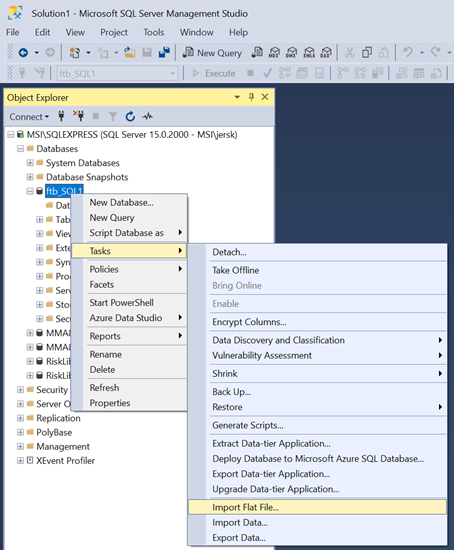
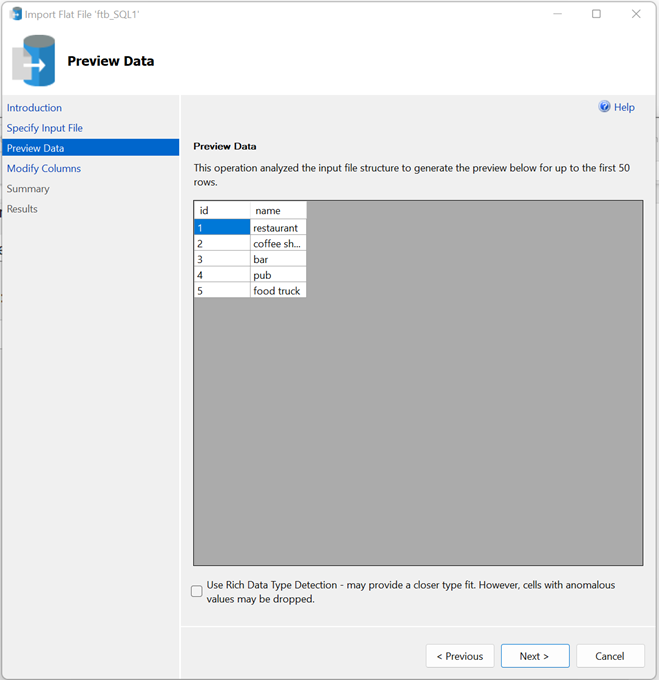

# FinTech Bootcamp Module 7 - SQL Assignment
Repo: ftb07_SQL_Challenge

## Import a CSV file with SQL Server Management Studio into a SQL Database
* Right-Click Database --> Tasks --> Import Flat File
    1. Launch Wizzard  
        
    2. Select CSV file  
        
    3. Preview Data  
        
    4. Configure Columns  
        
    5. Verify Import Parameters  
        
    6. Import Result  
        
